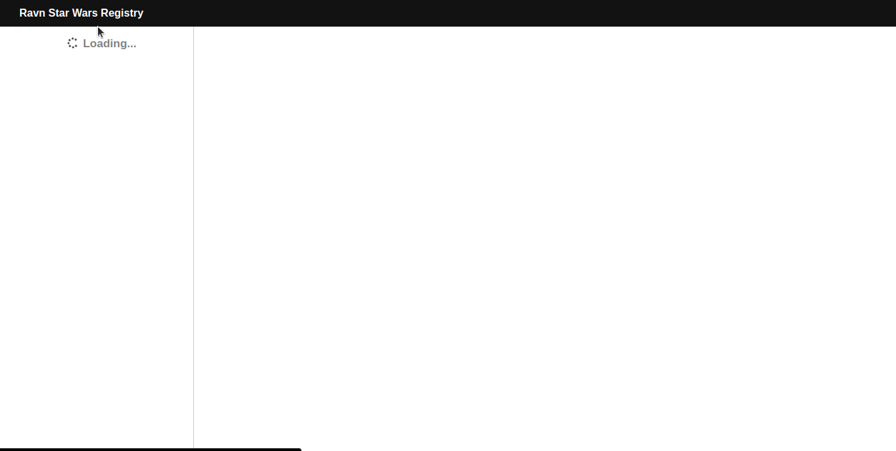

# Ravn-Challenge-V2
Web application that shows information of StarWars characters. Using React and Apollo Client.

## System requirements
* Node.js v15.x or later
* npm v7.5.x or later
* git v2.25.1 or later

## Programming Language
* JavaScript
* TypeScript

## Framework and dependencies
* React
* GraphQL
* Apollo Client
* SCSS
* Fontawesome

## How to run it?
1. Clone repository
    > `git clone https://github.com/aarontr24/Ravn-Challenge-V2-AaronTR`
2. Go directory
    > `cd Ravn-Challenge-V2-AaronTR`
3. Install dependencies
    > `npm install`
4. Start project
    > `npm start`

## Screenshots
+Working!

+Failed to load data!

